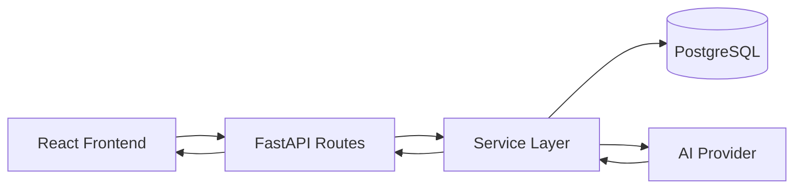

# Customer Support Ticketing CRM

AI-powered customer support CRM for creating, tracking, updating, and analyzing support tickets.

## Project Overview

This project is a full-stack support ticketing CRM built for an internship assessment. It gives a support team a clean dashboard for managing tickets and a backend AI assistant for generating ticket summaries and suggested replies.

The implementation is intentionally simple and organized so each layer is easy to explain:

- FastAPI handles the backend API.
- SQLAlchemy manages the database models and relationships.
- React + Vite provide the frontend dashboard and forms.
- The AI logic stays on the backend inside a dedicated service layer.

## Features

- Create support tickets
- View all tickets in a dashboard
- Search tickets by ticket ID, customer name, email, subject, or description
- Filter tickets by status
- View ticket details
- Update ticket status
- Add internal notes
- Analyze tickets with AI
- Generate an AI-suggested customer response

## AI Feature

The AI Ticket Assistant is available on the ticket details page. It returns:

- Summary
- Customer sentiment
- Priority
- Suggested customer response

The frontend never calls the LLM provider directly. React calls FastAPI, and FastAPI calls the AI provider through the backend service layer.

The AI layer is replaceable:

- If `GROQ_API_KEY` is set, the backend can call Groq.
- If `GEMINI_API_KEY` is set, the backend can call Gemini.
- If no provider key is configured, the app falls back to a deterministic backend analysis so the feature still works for demos.

## Architecture



Backend structure:

- `backend/app/main.py` - FastAPI app entry point and CORS setup
- `backend/app/config.py` - environment-backed settings
- `backend/app/database.py` - SQLAlchemy engine, session, and base
- `backend/app/models/` - SQLAlchemy models
- `backend/app/schemas/` - Pydantic request/response schemas
- `backend/app/routes/` - API route modules
- `backend/app/services/` - business logic and AI abstraction
- `backend/app/utils/` - helper utilities

Frontend structure:

- `frontend/src/pages/` - page-level screens
- `frontend/src/components/` - reusable UI pieces
- `frontend/src/services/api.js` - centralized Axios client and API helpers
- `frontend/src/styles.css` - shared design system styles

## Tech Stack

Backend:

- Python 3.11+
- FastAPI
- SQLAlchemy
- PostgreSQL
- Pydantic
- Alembic
- Uvicorn

Frontend:

- React
- Vite
- Tailwind CSS is listed in the assessment requirements, but this implementation keeps the UI lightweight with custom CSS for clarity and speed.
- Axios
- React Router
- Lucide React

AI:

- Gemini API or Groq API

## Database Schema

### `tickets`

- `id`: primary key
- `ticket_id`: unique generated string such as `TKT-001`
- `customer_name`
- `customer_email`
- `subject`
- `description`
- `status`: `Open | In Progress | Closed`
- `created_at`
- `updated_at`

### `notes`

- `id`: primary key
- `ticket_id`: foreign key referencing `tickets.id`
- `note_text`
- `created_at`

Relationship:

- One ticket has many notes.
- Notes are loaded on the ticket details page.

## API Endpoints

### Tickets

- `POST /api/tickets` - create a ticket
- `GET /api/tickets` - list tickets
- `GET /api/tickets?status=Open` - filter by status
- `GET /api/tickets?search=john` - search tickets
- `GET /api/tickets/{ticket_id}` - get ticket details
- `PUT /api/tickets/{ticket_id}` - update ticket status and add a note

### AI

- `POST /api/tickets/{ticket_id}/ai-analysis` - analyze a ticket with AI

## Environment Variables

### Backend

- `DATABASE_URL` - PostgreSQL connection string
- `GEMINI_API_KEY` - Gemini API key
- `GROQ_API_KEY` - Groq API key

### Frontend

- `VITE_API_URL` - backend API base URL

Use the example files:

- `backend/.env.example`
- `frontend/.env.example`

Never commit real secrets.

## Local Setup

### Backend

1. Create and activate a Python virtual environment.
2. Install dependencies from `backend/requirements.txt`.
3. Copy `backend/.env.example` to `backend/.env` and fill in your values.
4. Run Alembic migrations from the `backend` folder.
5. Start the API with Uvicorn from either the repository root or the `backend` folder.

Example:

```bash
cd backend
pip install -r requirements.txt
alembic upgrade head
uvicorn app.main:app --reload
```

From the repository root, the same command now works because of the import shim in `app/__init__.py`.

### Frontend

1. Install dependencies in the `frontend` folder.
2. Copy `frontend/.env.example` to `frontend/.env`.
3. Set `VITE_API_URL` to the backend URL.
4. Start the Vite dev server.

Example:

```bash
cd frontend
npm install
npm run dev
```

## Quick Start (Running Both Servers)

### From the Repository Root

**Terminal 1: Backend**

```bash
python -m uvicorn app.main:app --reload
```

**Terminal 2: Frontend**

```bash
npm --prefix frontend run dev
```

### From Individual Folders

**Terminal 1: Backend**

```bash
cd backend
python -m uvicorn app.main:app --reload
```

**Terminal 2: Frontend**

```bash
cd frontend
npm run dev
```

The backend will start on `http://localhost:8000` and the frontend on `http://localhost:5173`.

## How the AI Feature Works

1. The user opens a ticket details page.
2. The user clicks `Analyze with AI`.
3. React sends a request to FastAPI.
4. FastAPI loads the ticket and passes it to `services/ai_service.py`.
5. The AI service either calls Groq, calls Gemini, or uses the fallback analysis.
6. The backend validates the output and returns a stable JSON response to the frontend.
7. The frontend displays the summary, sentiment, priority, and suggested response.

## Important Design Decisions

- Business logic stays in service files, not in route handlers.
- The AI integration is isolated in one service so providers can be swapped later.
- Ticket IDs are generated automatically and remain human-readable.
- Search and filtering happen on both the backend and frontend for a responsive user experience.
- The UI uses a compact design system with reusable status badges, cards, and tables.
- Error handling is explicit so the user sees what failed and why.

## Future Improvements

- Add authentication and role-based access control
- Add pagination for large ticket lists
- Add richer note author metadata
- Replace the AI fallback with provider-specific prompt tuning
- Add testing for API routes and services
- Add background jobs for notifications and ticket automation
- Add better form state persistence and draft saving
